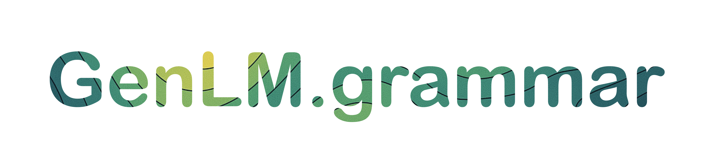

<p align="center">
  
  <a href="https://genlm.github.io/genlm-grammar/">
    
  </a>
  
  <a href="https://genlm.github.io/genlm-grammar/actions/workflows/pytest.yml">
    
  </a>
  
  <a href="https://codecov.io/github/genlm/genlm-grammar">
    
  </a>
  
  <a href="https://pypi.org/project/genlm-grammar/">
    
  </a>
  
</p>


A Python library for working with weighted context-free grammars (WCFGs), weighted finite state automata (WFSAs) and weighted finite state transducers (WFSTs). The library provides efficient implementations for grammar operations, parsing algorithms, and language model functionality.

## Quick Start

This library can be installed via pip:

```bash
pip install genlm-grammar
```

## Key Features

### Grammar Operations
- Support for weighted context-free grammars with various semirings (Boolean, Float, Real, MaxPlus, MaxTimes, etc.)
- Grammar transformations:
  - Local normalization
  - Removal of nullary rules and unary cycles
  - Grammar binarization
  - Length truncation
  - Renaming/renumbering of nonterminals

### Parsing Algorithms
- Earley parsing (O(n³|G|) complexity)
  - Standard implementation
  - Rescaled version for numerical stability
- CKY parsing
  - Incremental CKY with chart caching
  - Support for prefix computations

### Language Model Interface
- `BoolCFGLM`: Boolean-weighted CFG language model
- `CKYLM`: Probabilistic CFG language model using CKY
- `EarleyLM`: Language model using Earley parsing

### Finite State Automata
- Weighted FSA implementation
- Operations:
  - Epsilon removal
  - Minimization (Brzozowski's algorithm)
  - Determinization
  - Composition
  - Reversal
  - Kleene star/plus

### Additional Features
- Semiring abstractions (Boolean, Float, Log, Entropy, etc.)
- Efficient chart and agenda-based algorithms
- Grammar-FST composition
- Visualization support via Graphviz

## Development

See [DEVELOPING.md](DEVELOPING.md) for information on how to install the package in development mode.
